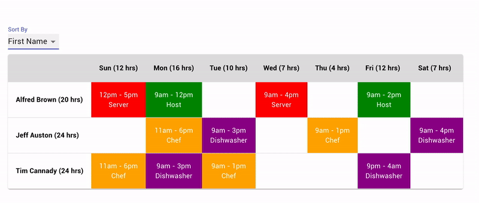

## Getting Started

Start the Rails backend server.

- Follow the official Rails documentation [here](https://guides.rubyonrails.org/getting_started.html#creating-a-new-rails-project) to get set up. Install Ruby, sqlite3, yarn, node etc.
- Clone this repository and run:
  `cd scheduler-be`,
  `bundle install` (install gems) and
  `bin/rails db:setup` (set up and seed the database).
- Start the server by running `bin/rails server`.

In a second terminal, start the JS/React/Redux frontend.

- `cd scheduler-fe`
- `yarn install`
- `PORT=3001 yarn start`

## Cutting corners / Design decisions

- Testing: Need to add tests for both the frontend and the backend.
- Linting: Should set up a linter to automatically check the code on commits.
- Code cleanup: This code can be cleaned up quite a lot. For example, my react components should be broken down into smaller ones so that it is easy to reuse them.
